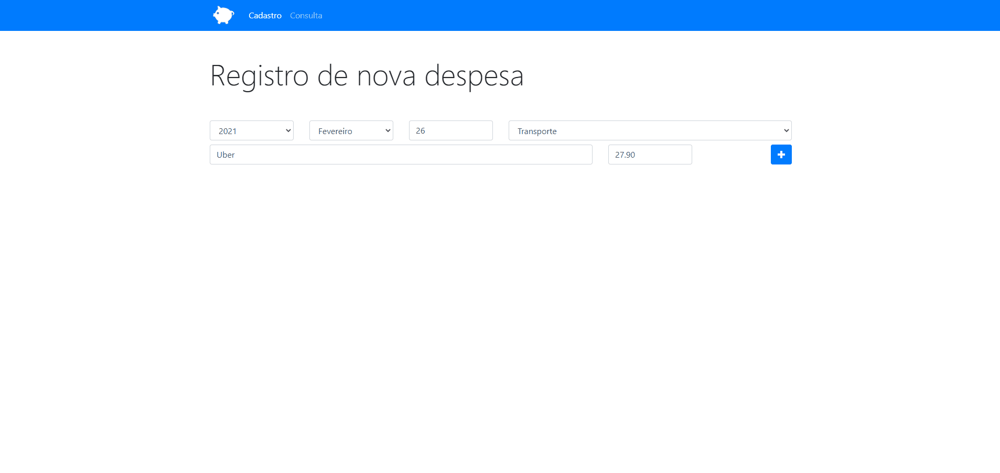

<h2 align="center">
Orçamento Pessoal
</h2>

  

<h3 align="center">  
  <a href="#information_source-sobre">Sobre</a> |
  <a href="#interrobang-motivo">Motivo</a> | 
  <a href="#rocket-tecnologias-utilizadas">Tecnologias</a> |  
</h3>

## :information_source: Sobre

Aplicação para gerenciamento de orçamentos, despesas e finanças pessoais com funcionalidades como adicionar, remover e filtrar despesas cadastradas.

## :interrobang: Motivo

O motivo do desenvolvimento da aplicação Orçamento Pessoal, é treinar e fixar estudos sobre a linguagem JavaScript e o paradigma de Orientação a Objetos.

## :rocket: Tecnologias Utilizadas

O projeto foi desenvolvido utilizando as seguintes tecnologias

- HTML
- CSS (framework Bootstrap)
- Javascript